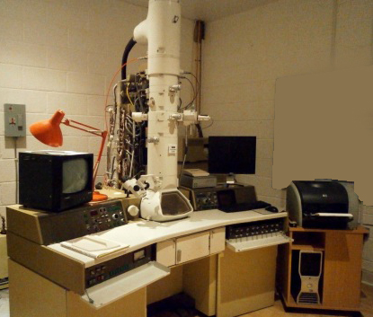
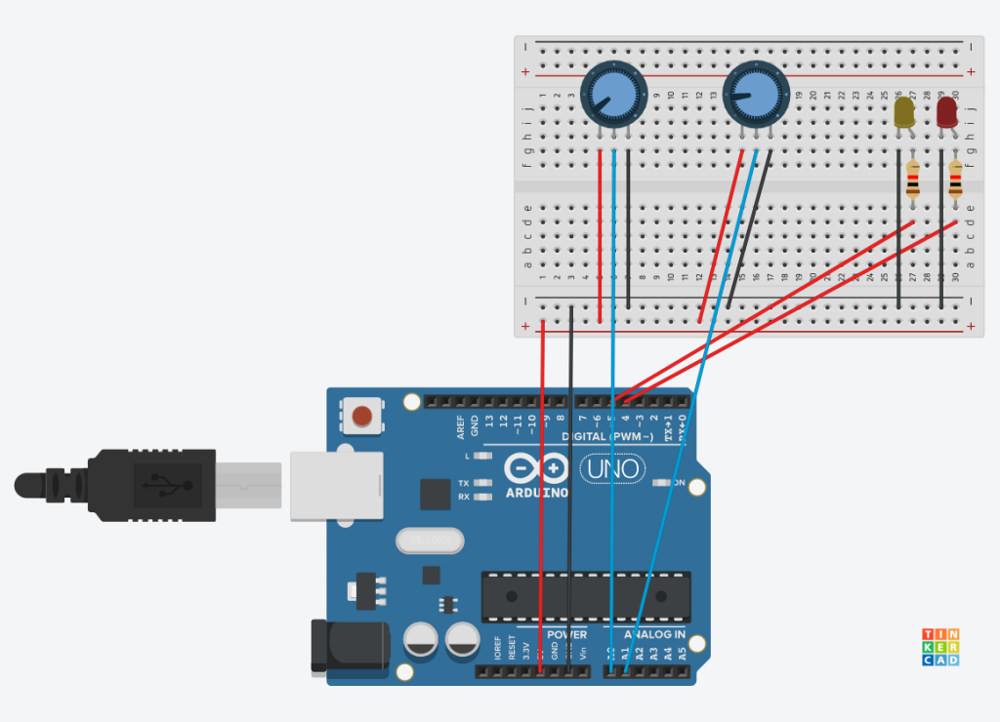

# Vacuum Control Board with Web Interface

This is an Arduino-based proof-of-concept for controlling the vacuum system of the JEOL JEM-2000FX
 transmission electron microscope. An Arduino board is wired to the microscope's Pirani gauges and control valves. Mounted on the board is an ethernet shield. The user connects a computer to the shield with an ethernet cable and then manages the vacuum system via an Ajax-based web page found at a local IP address.

&nbsp;   
&nbsp;  
Test circuit design

